---
# Get YAML keywords from myYAML_ref.Rmd
title: "<ProjectName>: <rsp_var_raw> <regression/classification>:: <scriptName>"
author: "bdanalytics"

# Choose one:
output:
    html_document:
        keep_md: yes
        pandoc_args: ["+RTS", "-K256M", "-RTS"]

# output:
#   pdf_document:
#     fig_width: 8
#     highlight: zenburn
#     #keep_md: yes
#     keep_tex: yes
#     number_sections: yes
#     toc: yes
---

**  **    
**Date: `r format(Sys.time(), "(%a) %b %d, %Y")`**    

# Introduction:  

Data: 
Source: 
    Training:   <obsTrnFileName>  
    New:        <obsNewFileName>  
Time period: 

```{r set_global_options_wd, echo=FALSE}
setwd("~/Documents/Work/<ProjectPath>")
# print(names(sys.frame(1)))
# print(getSrcFilename(function (x) { x }))
#print(sys.frame(1)$file)
# stop(here")
```

# Synopsis:

## Background

US Federal Government:
Bureau of Consumer Financial Protection (CFPB): Consumer Complaint Database: 
Metadata Updated: Sep 26, 2015 

CFPB can increase its effectiveness & customer satisfaction by minimizing disputes escalated by consumers when businesses initially respond to consumer complaints in a timely manner.

The objective is to create a classifier that predicts if a customer will dispute the resolution of a specific complaint with a bank:  Consumer Dispute? (Yes or No).

The observations are complaints CFPB received about financial products and services from US residents.

## Results: Prepaid Cards only:

### Feature Importance of selected Generalized Boosted Model (GBM) 

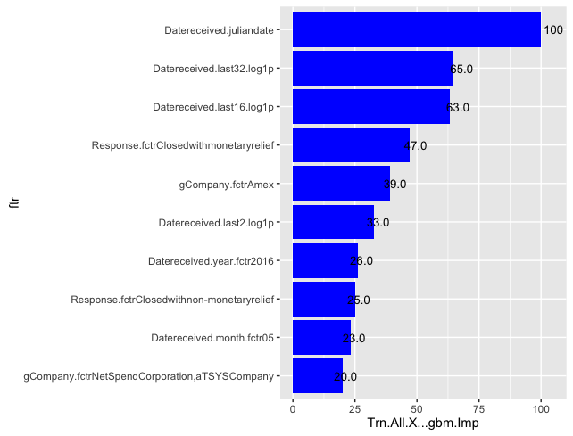

The model suggests that resolutions are disputed mainly based on the period of the year the complaints are first registered and the "velocity" of such complaints.

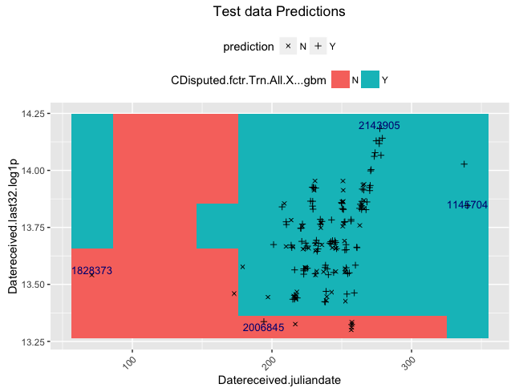

For some reason complaints registered in Q2 of any year does not result in disputes compared to other quarters. Further investigation is warranted to understand this driver / issue.


Additionally, when the velocity of complaints decreases, the number of disputes increase. 

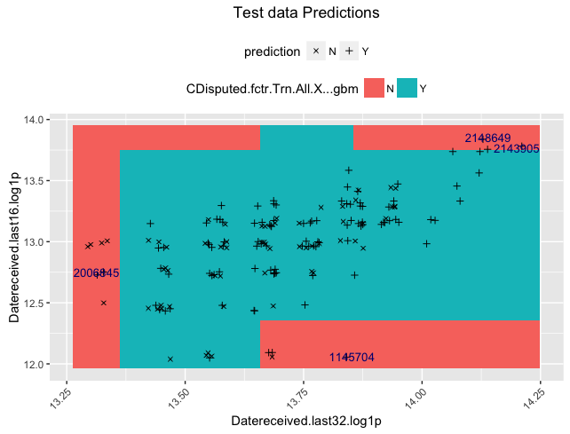

This is completely counter-intuitive and the initial hypothesis is that when complaint submissions are rare, the financial company has more time to investigate the complaint and it might be naturally biased to resolve it in favor of the company. This hypothesis needs to be tested and verified. If true, the company could potentially adopt one or more of the following approaches to resolve the complaint:

- Have CFPB / company use a "neutral" arbitrator to generate the initial "resolution".
- Train the resolution team to minimize any bias (implict / explicit).
- Have CFPB review the initial resolution prior to communicating it to the complainant.

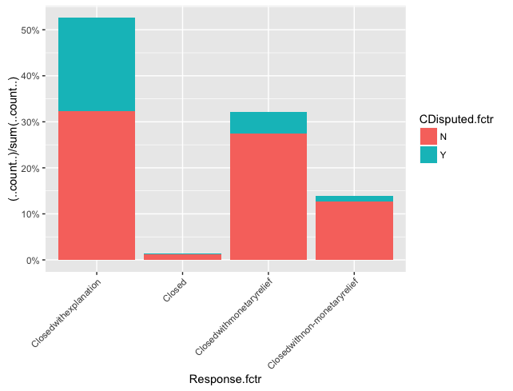

Any "relief" (monetary / non-monetary) minimizes chances of complaint escalating to a dispute.

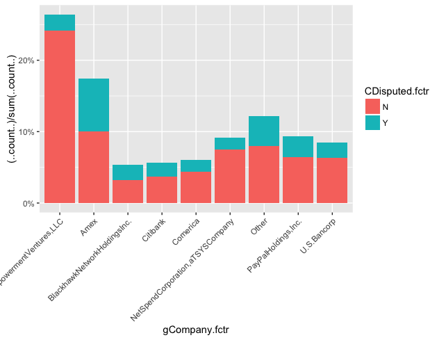

American Express seems to lead in percent of complaints escalating to a dispute. CFPB might consider conducting workshops for Amex personnel and/or process mining techniques to alleviate this.

## Analytics Process Key Steps:

- Feature Engineering:
  - Extractions from dates include:
    - "Datereceived.year.fctr"    "Datereceived.month.fctr"  
    - "Datereceived.date.fctr"    "Datereceived.juliandate"  
    - "Datereceived.wkday.fctr"   "Datereceived.wkend"       
    - "Datereceived.last2.log1p" 
    - "Datereceived.last4.log1p"  "Datereceived.last8.log1p" 
    - "Datereceived.last16.log1p" "Datereceived.last32.log1p"
    
    - "Datereceived.hlday"  (Federal holidays were sourced from US Government OPM website)      

    - "Sent.Recd.Dys"       
    - "Sent.Recd.Dys.log1p" "Sent.Recd.Dys.root2" "Sent.Recd.Dys.nexp" 
    - Similar transformations were included for all non-normal distributions
    
- Clustering:

  Hierarchial clustering by Subproduct decreased entropy of dataset from 0.4267 to 0.4067 (~ 4.6%)
    
- Rebalance classes

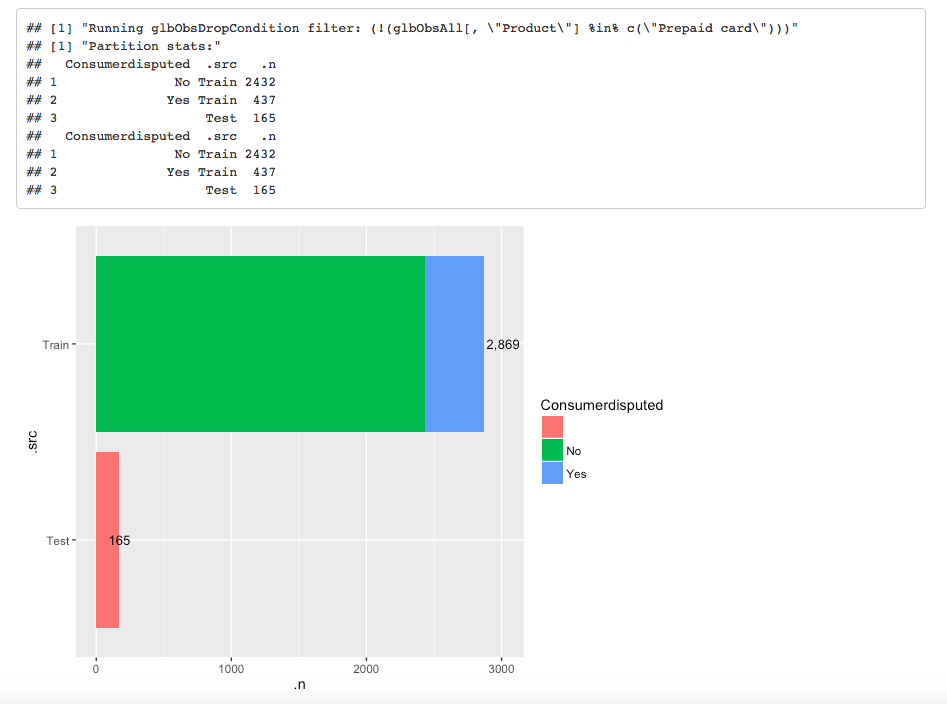
  
  Since the number of disputes is a small proportion (< 15%) of the complaints, undisputed complaints that did not meet the Tomek link criteria were not fed to the classifier training process.
  
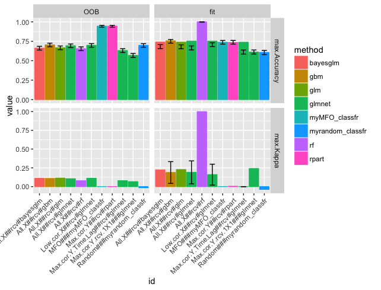  

Multiple algorithms were tested and gbm was selected based on accuracy (g.score) and value of insights suggested by the model

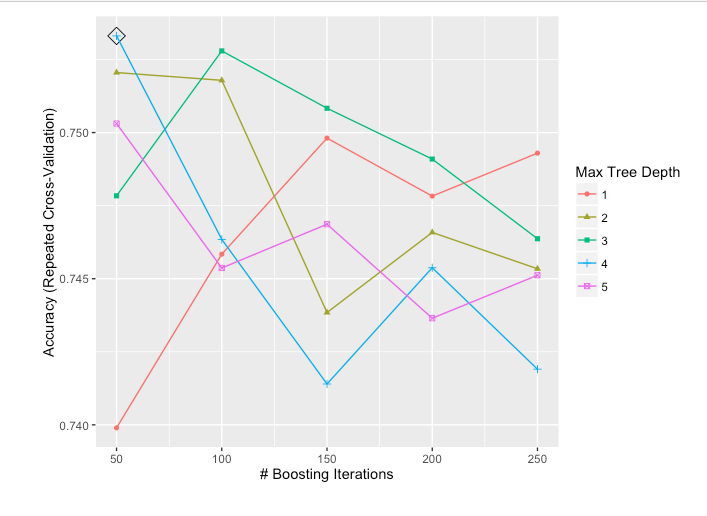

The selected model utilized repeated cross-validation of 7 folds with 3 repeats and 5 tuning grid specifications

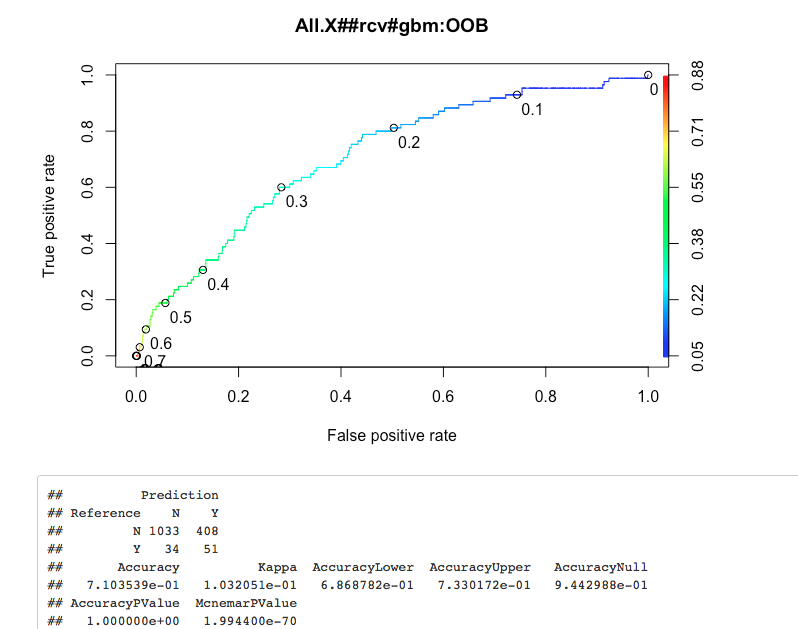

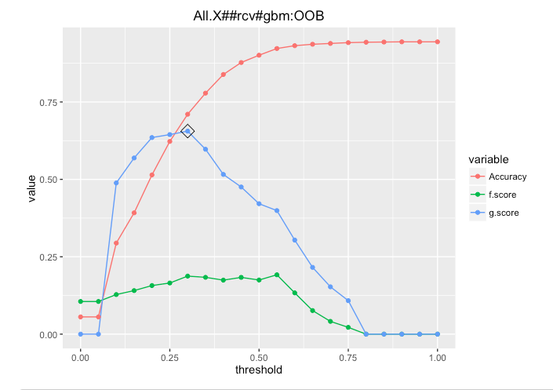

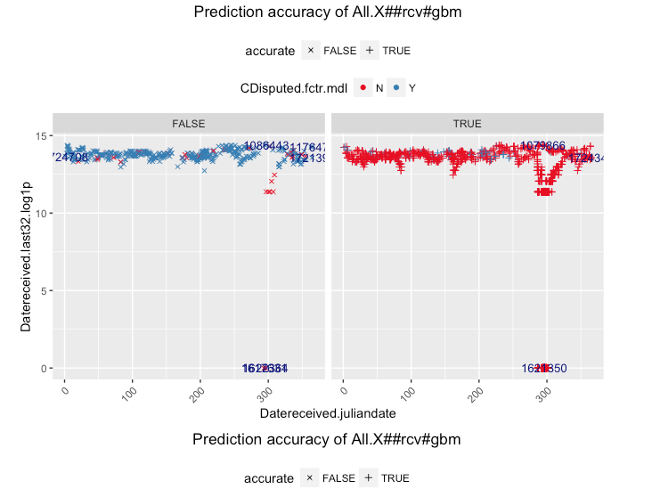

## Potential next steps include:

- Feature Engineering:
  - DateRecieved, DateSenttocompany: 
    - Add State & City holidays for each year
    - Add number of complaints received and sent for this complaint's date
    
  - Product: Include all & create product groups to minimize model stacks  
    
  - NLP: Issue, SubIssue, "Consumercomplaintnarrative", "Companypublicresponse"
  - Company: 
    - Identify Industry based on stock / Dun & Bradstreet listing
    - Create clusters based on Product, Subproduct & Company
    
- Identify outliers in fitting data frame [glbObsFit, glbObsTrn] and if any, move to validation data frame [glbObsOOB, None]     

- Fine tune algorithm hyper-parameters (e.g. alpha & lambda for glmnet)

- Testing options:  
  - Preprocessing (center, scaling, PCA, etc.)
  - Resampling (Boot strapping, LGOCV, etc.)
  - Ensemble models
  
- Organization:
    - Categorize by chunk
    - Priority criteria:
        0. Ease of change
        1. Impacts report
        2. Cleans innards
        3. Bug report
        
- all chunks:
    - at chunk-end rm(!glb_<var>)
    
- manage.missing.data chunk:
    - cleaner way to manage re-splitting of training vs. new entity

- extract.features chunk:
    - Add n-grams for glbFeatsText
        - "RTextTools", "tau", "RWeka", and "textcat" packages
    
- fit.models chunk:
    - Classification: Plot AUC Curves for all models & highlight glbMdlSlt
    - Prediction accuracy scatter graph:
    -   Add tiles (raw vs. PCA)
    -   Use shiny for drop-down of "important" features
    -   Use plot.ly for interactive plots ?
    
    - Change .fit suffix of model metrics to .mdl if it's data independent (e.g. AIC, Adj.R.Squared - is it truly data independent ?, etc.)
    - create a custom model for rpart that has minbucket as a tuning parameter
    - varImp for randomForest crashes in caret version:6.0.41 -> submit bug report

- Probability handling for multinomials vs. desired binomial outcome
-   ROCR currently supports only evaluation of binary classification tasks (version 1.0.7)
-   extensions toward multiclass classification are scheduled for the next release

- fit.all.training chunk:
    - myplot_prediction_classification: displays 'x' instead of '+' when there are no prediction errors 
- Compare glbMdlSlt vs. glbMdlFnlNsl:
    - varImp
    - Prediction differences (shd be minimal ?)

- Move glb_analytics_diag_plots to mydsutils.R: (+) Easier to debug (-) Too many glb vars used
- Add print(ggplot.petrinet(glb_analytics_pn) + coord_flip()) at the end of every major chunk
- Parameterize glb_analytics_pn
- Move glb_impute_missing_data to mydsutils.R: (-) Too many glb vars used; glb_<>_df reassigned
- Do non-glm methods handle interaction terms ?
- f-score computation for classifiers should be summation across outcomes (not just the desired one ?)
- Add accuracy computation to glb_dmy_mdl in predict.data.new chunk
- Why does splitting fit.data.training.all chunk into separate chunks add an overhead of ~30 secs ? It's not rbind b/c other chunks have lower elapsed time. Is it the number of plots ?
- Incorporate code chunks in print_sessionInfo
- Test against 
    - projects in github.com/bdanalytics
    - lectures in jhu-datascience track

# Analysis: 
```{r set_global_options}
rm(list = ls())
set.seed(12345)
options(stringsAsFactors = FALSE)
source("~/Dropbox/datascience/R/mycaret.R")
source("~/Dropbox/datascience/R/mypetrinet.R")
source("~/Dropbox/datascience/R/myplclust.R")
source("~/Dropbox/datascience/R/myplot.R")
source("~/Dropbox/datascience/R/myscript.R")
source("~/Dropbox/datascience/R/mytm.R")
if (is.null(knitr::opts_current$get(name = 'label'))) # Running in IDE
    debugSource("~/Dropbox/datascience/R/mydsutils.R") else
    source("~/Dropbox/datascience/R/mydsutils.R")    
# Gather all package requirements here
suppressPackageStartupMessages(require(doMC))
glbCores <- 10 # of cores on machine - 2
registerDoMC(glbCores) 

suppressPackageStartupMessages(require(caret))
require(plyr)
require(dplyr)
require(knitr)
require(stringr)
#source("dbgcaret.R")
#packageVersion("snow")
#require(sos); findFn("cosine", maxPages=2, sortby="MaxScore")

# Analysis control global variables
# Inputs
#   url/name = "<PathPointer>"; if url specifies a zip file, name = "<filename>"; 
#               or named collection of <PathPointer>s
#   sep = choose from c(NULL, "\t")
glbObsTrnFile <- list(url = "<obsTrnFileName>" 
    # or list(url = c(NULL, <.inp1> = "<path1>", <.inp2> = "<path2>"))
    #, splitSpecs = list(method = "copy" # default when glbObsNewFile is NULL
    #                       select from c("copy", NULL ???, "condition", "sample", )
    #                      ,nRatio = 0.3 # > 0 && < 1 if method == "sample" 
    #                      ,seed = 123 # any integer or glbObsTrnPartitionSeed if method == "sample" 
    #                      ,condition = # or 'is.na(<var>)'; '<var> <condition_operator> <value>'    
    #                      )
    )                   
 
glbObsNewFile <- NULL # default OR list(url = "<obsNewFileName>") 

glbObsDropCondition <- NULL # : default
#   enclose in single-quotes b/c condition might include double qoutes
#       use | & ; NOT || &&    
#   '<condition>' 
    # 'grepl("^First Draft Video:", glbObsAll$Headline)'
    # 'is.na(glbObsAll[, glb_rsp_var_raw])'
    # '(is.na(glbObsAll[, glb_rsp_var_raw]) & grepl("Train", glbObsAll[, glbFeatsId]))'
    # 'is.na(strptime(glbObsAll[, "Date"], glbFeatsDateTime[["Date"]]["format"], tz = glbFeatsDateTime[["Date"]]["timezone"]))'
    # '(is.na(glbObsAll[, "Q109244"]) | (glbObsAll[, "Q109244"] != "No"))'
#nrow(do.call("subset",list(glbObsAll, parse(text=paste0("!(", glbObsDropCondition, ")")))))
    
glb_obs_repartition_train_condition <- NULL # : default
#    "<condition>" 

glb_max_fitobs <- NULL # or any integer
glbObsTrnPartitionSeed <- 123 # or any integer
                         
glb_is_regression <- TRUE; glb_is_classification <- !glb_is_regression; 
    glb_is_binomial <- NULL # or TRUE or FALSE

glb_rsp_var_raw <- "<rsp_var_raw>"

# for classification, the response variable has to be a factor
glb_rsp_var <- glb_rsp_var_raw # or "<rsp_var_raw>.fctr"

# if the response factor is based on numbers/logicals e.g (0/1 OR TRUE/FALSE vs. "A"/"B"), 
#   or contains spaces (e.g. "Not in Labor Force")
#   caret predict(..., type="prob") crashes
glb_map_rsp_raw_to_var <- NULL 
# function(raw) {
#     return(raw ^ 0.5)
#     return(log(raw))
#     return(log(1 + raw))
#     return(log10(raw)) 
#     return(exp(-raw / 2))
#     
# chk ref value against frequencies vs. alpha sort order
#    ret_vals <- rep_len(NA, length(raw)); 
#    ret_vals[raw != ""] <- ifelse(raw[raw != ""] == "Yes", "Y", "N");
#    return(relevel(as.factor(ret_vals), ref="N"))
#
#     as.factor(paste0("B", raw))
#     as.factor(gsub(" ", "\\.", raw))    
#     }

#if glb_rsp_var_raw is numeric:
#print(summary(glbObsAll[, glb_rsp_var_raw]))
#glb_map_rsp_raw_to_var(tst <- c(NA, as.numeric(summary(glbObsAll[, glb_rsp_var_raw])))) 

#if glb_rsp_var_raw is character:
#print(table(glbObsAll[, glb_rsp_var_raw], useNA = "ifany"))
#print(table(glb_map_rsp_raw_to_var(tst <- glbObsAll[, glb_rsp_var_raw]), useNA = "ifany")) 

glb_map_rsp_var_to_raw <- NULL 
# function(var) {
#     return(var ^ 2.0)
#     return(exp(var))
#     return(10 ^ var) 
#     return(-log(var) * 2)
#     as.numeric(var)
#     levels(var)[as.numeric(var)]
#     sapply(levels(var)[as.numeric(var)], function(elm) 
#         if (is.na(elm)) return(elm) else
#         if (elm == 'R') return("Republican") else
#         if (elm == 'D') return("Democrat") else
#         stop("glb_map_rsp_var_to_raw: unexpected value: ", elm)
#         )  
#     gsub("\\.", " ", levels(var)[as.numeric(var)])
#     c("<=50K", " >50K")[as.numeric(var)]
#     c(FALSE, TRUE)[as.numeric(var)]
# }
#print(table(glb_map_rsp_var_to_raw(glb_map_rsp_raw_to_var(tst)), useNA = "ifany"))

if ((glb_rsp_var != glb_rsp_var_raw) && is.null(glb_map_rsp_raw_to_var))
    stop("glb_map_rsp_raw_to_var function expected")

# List info gathered for various columns
# <col_name>:   <description>; <notes>

# currently does not handle more than 1 column; consider concatenating multiple columns
# If glbFeatsId == NULL, ".rownames <- as.numeric(row.names())" is the default
glbFeatsId <- NULL # choose from c(NULL : default, "<id_feat>") 
glbFeatsCategory <- NULL # choose from c(NULL : default, "<category_feat>")

# User-specified exclusions
glbFeatsExclude <- c(NULL
#   Feats that shd be excluded due to known causation by prediction variable
# , "<feat1", "<feat2>"
#   Feats that are factors with unique values (as % of nObs) > 49 (empirically derived)
#   Feats that are linear combinations (alias in glm)
#   Feature-engineering phase -> start by excluding all features except id & category & 
#       work each one in
                    ) 
if (glb_rsp_var_raw != glb_rsp_var)
    glbFeatsExclude <- union(glbFeatsExclude, glb_rsp_var_raw)                    

glbFeatsInteractionOnly <- list()
#glbFeatsInteractionOnly[["<child_feat>"]] <- "<parent_feat>"

glbFeatsDrop <- c(NULL
                # , "<feat1>", "<feat2>"
                )

glb_map_vars <- NULL # or c("<var1>", "<var2>")
glb_map_urls <- list();
# glb_map_urls[["<var1>"]] <- "<var1.url>"

# Derived features; Use this mechanism to cleanse data ??? Cons: Data duplication ???
glbFeatsDerive <- list();

# glbFeatsDerive[["<feat.my.sfx>"]] <- list(
#     mapfn = function(<arg1>, <arg2>) { return(function(<arg1>, <arg2>)) } 
#   , args = c("<arg1>", "<arg2>"))
#myprint_df(data.frame(ImageId = mapfn(glbObsAll$.src, glbObsAll$.pos)))
#data.frame(ImageId = mapfn(glbObsAll$.src, glbObsAll$.pos))[7045:7055, ]

    # character
#     mapfn = function(raw1) { raw1[is.na(raw1)] <- "NA.my"; return(as.factor(raw1)) } 
#     mapfn = function(raw1) { return(substr(raw1, 1, 10)) }
#     mapfn = function(raw1) { return(sapply(raw1, function(thsName) 
#                                             str_sub(unlist(str_split(thsName, ","))[1], 1, 1))) } 

#     mapfn = function(raw1) { return(plyr::revalue(raw1, c(
#         "ABANDONED BUILDING"  = "OTHER",
#         "**"                  = "**"
#                                           ))) }

#     mapfn = function(raw1) { mod_raw <- raw1;
    # This is here because it does not work if it's in txt_map_filename
#         mod_raw <- gsub(paste0(c("\n", "\211", "\235", "\317", "\333"), collapse = "|"), " ", mod_raw)
    # Don't parse for "." because of ".com"; use customized gsub for that text
#         mod_raw <- gsub("(\\w)(!|\\*|,|-|/)(\\w)", "\\1\\2 \\3", mod_raw);
    # Some state acrnoyms need context for separation e.g. 
    #   LA/L.A. could either be "Louisiana" or "LosAngeles"
        # modRaw <- gsub("\\bL\\.A\\.( |,|')", "LosAngeles\\1", modRaw);
    #   OK/O.K. could either be "Oklahoma" or "Okay"
#         modRaw <- gsub("\\bACA OK\\b", "ACA OKay", modRaw); 
#         modRaw <- gsub("\\bNow O\\.K\\.\\b", "Now OKay", modRaw);        
    #   PR/P.R. could either be "PuertoRico" or "Public Relations"        
        # modRaw <- gsub("\\bP\\.R\\. Campaign", "PublicRelations Campaign", modRaw);        
    #   VA/V.A. could either be "Virginia" or "VeteransAdministration"        
        # modRaw <- gsub("\\bthe V\\.A\\.\\:", "the VeteranAffairs:", modRaw);
    #   
    # Custom mods

#         return(mod_raw) }

	# date
#	    mapfn = function(raw1, raw2) { return(as.numeric(difftime(strptime(raw1, format = "%m/%d/%Y"),  strptime(raw2, format = "%m/%d/%Y"), units = "days"))) }


    # numeric
# Create feature based on record position/id in data   
glbFeatsDerive[[".pos"]] <- list(
    mapfn = function(raw1) { return(1:length(raw1)) }       
    , args = c(".rnorm"))    
glbFeatsDerive[[".pos.y"]] <- list(
    mapfn = function(raw1) { return(1:length(raw1)) }       
    , args = c(".rnorm"))    

# Add logs of numerics that are not distributed normally
#   Derive & keep multiple transformations of the same feature, if normality is hard to achieve with just one transformation
#   Right skew: logp1; sqrt; ^ 1/3; logp1(logp1); log10; exp(-<feat>/constant)
# glbFeatsDerive[["WordCount.log1p"]] <- list(
#     mapfn = function(raw1) { return(log1p(raw1)) } 
#   , args = c("WordCount"))
# glbFeatsDerive[["WordCount.root2"]] <- list(
#     mapfn = function(raw1) { return(raw1 ^ (1/2)) } 
#   , args = c("WordCount"))
# glbFeatsDerive[["WordCount.nexp"]] <- list(
#     mapfn = function(raw1) { return(exp(-raw1)) } 
#   , args = c("WordCount"))
#print(summary(glbObsAll$WordCount))
#print(summary(mapfn(glbObsAll$WordCount)))
    
# If imputation shd be skipped for this feature
# glbFeatsDerive[["District.fctr"]] <- list(
#     mapfn = function(raw1) {
#         raw <- raw1;
#         ret_vals <- rep_len("NA", length(raw)); 
#         ret_vals[!is.na(raw)] <- sapply(raw[!is.na(raw)], function(elm) 
#                                         ifelse(elm < 10, "1-9", 
#                                         ifelse(elm < 20, "10-19", "20+")));
#         return(relevel(as.factor(ret_vals), ref = "NA"))
#     }
#     mapfn = function(raw1) { raw <- 2016 - raw1; 
#         # raw[!is.na(raw) & raw >= 2010] <- NA
#         raw[!is.na(raw) & (raw <= 15)] <- NA
#         raw[!is.na(raw) & (raw >= 90)] <- NA        
#         retVal <- rep_len("NA", length(raw))
#         # breaks = c(1879, seq(1949, 1989, 10), 2049)
#         # cutVal <- cut(raw[!is.na(raw)], breaks = breaks, 
#         #               labels = as.character(breaks + 1)[1:(length(breaks) - 1)])
#         cutVal <- cut(raw[!is.na(raw)], breaks = c(15, 20, 25, 30, 35, 40, 50, 65, 90))
#         retVal[!is.na(raw)] <- levels(cutVal)[cutVal]
#         return(factor(retVal, levels = c("NA"
#                 ,"(15,20]","(20,25]","(25,30]","(30,35]","(35,40]","(40,50]","(50,65]","(65,90]"),
#                         ordered = TRUE))
#     }       
#     , args = c("District"))    

# If imputation of missing data is not working ...
# glbFeatsDerive[["FertilityRate.nonNA"]] <- list(
#     mapfn = function(raw1, raw2) {
#         RegionMdn <- tapply(raw1, raw2, FUN = median, na.rm = TRUE)
# 
#         retVal <- raw1
#         retVal[is.na(raw1)] <- RegionMdn[raw2[is.na(raw1)]]
#         return(retVal)
#     }
#     , args = c("FertilityRate", "Region"))

# for (qsn in grep("Q12", glbFeatsExclude, fixed = TRUE, value = TRUE))    
#     glbFeatsDerive[[paste0(qsn, ".fctr")]] <- list(
#         mapfn = function(raw1) {
#             raw1[raw1 %in% ""] <- "NA"
#             rawVal <- unique(raw1)
#             
#             if (length(setdiff(rawVal, (expVal <- c("NA", "No", "Ys")))) == 0) {
#                 raw1 <- gsub("Yes", "Ys", raw1, fixed = TRUE)
#                 if (length(setdiff(rawVal, expVal)) > 0)
#                     stop(qsn, " vals: ", paste0(rawVal, collapse = "|"), 
#                          " does not match expectation: ", paste0(expVal, collapse = "|"))
#             } else
#             if (length(setdiff(rawVal, (expVal <- c("NA", "Private", "Public")))) == 0) {
#                 raw1 <- gsub("Private", "Pt", raw1, fixed = TRUE)
#                 raw1 <- gsub("Public" , "Pc", raw1, fixed = TRUE)                
#                 if (length(setdiff(rawVal, expVal)) > 0)
#                     stop(qsn, " vals: ", paste0(rawVal, collapse = "|"), 
#                          " does not match expectation: ", paste0(expVal, collapse = "|"))
#             }
#             
#             return(relevel(as.factor(raw1), ref = "NA"))
#         }
#         , args = c(qsn))
    
#     mapfn = function(raw1) { return(cut(raw1, 5, breaks = c(0, 100000, 200000, 300000, 900000), labels = NULL)) }     
#     mapfn = function(raw1)  { return(ifelse(sign(raw1) >= 0, 1, 0)) } 
#     mapfn = function(raw1) { return(raw1 ^ (1/2)) }       
#     mapfn = function(raw1) { return(log1p(raw1)) }   
#     mapfn = function(raw1) { return(exp(-raw1 / 20)) }
#     mapfn = function(raw1) { return(scale(log1p(raw1))) }     
#     mapfn = function(raw1) { return(sign(raw1) * (abs(raw1) ^ (1/10))) }        

    # factor      
#     mapfn = function(raw1) { return(as.factor(ifelse(raw1 >= 0.5, "Y", "N"))) }
#     mapfn = function(raw1) { as.factor(gsub(" ", "", raw1)) }
#     mapfn = function(raw1) { return(relevel(as.factor(raw1), ref="all_other")) }
#     mapfn = function(raw1) { tfr_raw <- as.character(cut(raw1, 5)); 
#                             tfr_raw[is.na(tfr_raw)] <- "NA.my";
#                             return(as.factor(tfr_raw)) }
#     mapfn = function(raw1) { return(cut(raw1, 3)) }
#     mapfn = function(raw1) { return(cut(raw1, c(-1000, -100, -10, -1, 0, 1, 10, 100, 1000))) }    

#     , args = c("<arg1>"))
    
    # multiple args
#     mapfn = function(raw1, raw2) { return(paste(as.character(raw1), as.character(raw2), sep = "#")) }        
#     mapfn = function(raw1, raw2) { return(raw1 - raw2) }
#     mapfn = function(raw1, raw2) { return(spdiff <- (10 ^ raw1) - raw2) } 
#     mapfn = function(raw1, raw2) { as.factor(
#         paste(gsub(" ", "", raw1), as.numeric(nchar(raw2) > 0), sep = "*")) }
#     mapfn = function(raw1, raw2) { 
#         return(paste(raw1, sprintf("%04d", 
#                                    ifelse(raw1 == "Train", raw2, raw2 - 7049)
#                                    ), sep = "#")) }       

# # If glbObsAll is not sorted in the desired manner
#     mapfn=function(raw1) { return(coredata(lag(zoo(orderBy(~Week, glbObsAll)$ILI), -2, na.pad=TRUE))) }
#     mapfn=function(raw1) { return(coredata(lag(zoo(raw1), -2, na.pad=TRUE))) }
#     mapfn=function(raw1) { return(log1p(raw1)) }

# glbFeatsDerive[["<var1>"]] <- glbFeatsDerive[["<var2>"]]

# tst <- "descr.my"; args_lst <- NULL; for (arg in glbFeatsDerive[[tst]]$args) args_lst[[arg]] <- glbObsAll[, arg]; print(head(args_lst[[arg]])); print(head(drv_vals <- do.call(glbFeatsDerive[[tst]]$mapfn, args_lst))); 
# print(which_ix <- which(args_lst[[arg]] == 0.75)); print(drv_vals[which_ix]); 

glbFeatsDateTime <- list()
# Use OlsonNames() to enumerate supported time zones
# glbFeatsDateTime[["<DateTimeFeat>"]] <- 
#     c(format = "%Y-%m-%d %H:%M:%S" or "%m/%e/%y", timezone = "US/Eastern", impute.na = TRUE, 
#       last.ctg = FALSE, poly.ctg = FALSE)

glbFeatsPrice <- NULL # or c("<price_var>")

glbFeatsImage <- list() #list(<imageFeat> = list(patchSize = 10)) # if patchSize not specified, no patch computation

glbFeatsText <- list()
Sys.setlocale("LC_ALL", "C") # For english

#glbFeatsText[["<TextFeature>"]] <- list(NULL,
#   ,names = myreplacePunctuation(str_to_lower(gsub(" ", "", c(NULL, 
#       <comma-separated-screened-names>
#   ))))
#   ,rareWords = myreplacePunctuation(str_to_lower(gsub(" ", "", c(NULL, 
#       <comma-separated-nonSCOWL-words>
#   ))))
#)

# Text Processing Step: custom modifications not present in txt_munge -> use glbFeatsDerive
# Text Processing Step: universal modifications
glb_txt_munge_filenames_pfx <- "<projectId>_mytxt_"

# Text Processing Step: tolower
# Text Processing Step: myreplacePunctuation
# Text Processing Step: removeWords
glb_txt_stop_words <- list()
# Remember to use unstemmed words
if (length(glbFeatsText) > 0) {
    require(tm)
    require(stringr)

    glb_txt_stop_words[["<txt_var>"]] <- 
      sort(myreplacePunctuation(str_to_lower(gsub(" ", "", c(NULL
        # Remove any words from stopwords            
#         , setdiff(myreplacePunctuation(stopwords("english")), c("<keep_wrd1>", <keep_wrd2>"))
                                
        # Remove salutations
        ,"mr","mrs","dr","Rev"                                

        # Remove misc
        #,"th" # Happy [[:digit::]]+th birthday 

        # Remove terms present in Trn only or New only; search for "Partition post-stem"
        #   ,<comma-separated-terms>        

        # cor.y.train == NA
#         ,unlist(strsplit(paste(c(NULL
#           ,"<comma-separated-terms>"
#         ), collapse=",")

        # freq == 1; keep c("<comma-separated-terms-to-keep>")
            # ,<comma-separated-terms>

        # chisq.pval high (e.g. == 1); keep c("<comma-separated-terms-to-keep>")
            # ,<comma-separated-terms>

        # nzv.freqRatio high (e.g. >= glbFeatsNzvFreqMax); keep c("<comma-separated-terms-to-keep>")
            # ,<comma-separated-terms>        
                                            )))))
}
#orderBy(~term, glb_post_stem_words_terms_df_lst[[txtFeat]][grep("^man", glb_post_stem_words_terms_df_lst[[txtFeat]]$term), ])
#glbObsAll[glb_post_stem_words_terms_mtrx_lst[[txtFeat]][, 4866] > 0, c(glb_rsp_var, txtFeat)]

# To identify terms with a specific freq
#paste0(sort(subset(glb_post_stop_words_terms_df_lst[[txtFeat]], freq == 1)$term), collapse = ",")
#paste0(sort(subset(glb_post_stem_words_terms_df_lst[[txtFeat]], freq <= 2)$term), collapse = ",")
#subset(glb_post_stem_words_terms_df_lst[[txtFeat]], term %in% c("zinger"))

# To identify terms with a specific freq & 
#   are not stemmed together later OR is value of color.fctr (e.g. gold)
#paste0(sort(subset(glb_post_stop_words_terms_df_lst[[txtFeat]], (freq == 1) & !(term %in% c("blacked","blemish","blocked","blocks","buying","cables","careful","carefully","changed","changing","chargers","cleanly","cleared","connect","connects","connected","contains","cosmetics","default","defaulting","defective","definitely","describe","described","devices","displays","drop","drops","engravement","excellant","excellently","feels","fix","flawlessly","frame","framing","gentle","gold","guarantee","guarantees","handled","handling","having","install","iphone","iphones","keeped","keeps","known","lights","line","lining","liquid","liquidation","looking","lots","manuals","manufacture","minis","most","mostly","network","networks","noted","opening","operated","performance","performs","person","personalized","photograph","physically","placed","places","powering","pre","previously","products","protection","purchasing","returned","rotate","rotation","running","sales","second","seconds","shipped","shuts","sides","skin","skinned","sticker","storing","thats","theres","touching","unusable","update","updates","upgrade","weeks","wrapped","verified","verify") ))$term), collapse = ",")

#print(subset(glb_post_stem_words_terms_df_lst[[txtFeat]], (freq <= 2)))
#glbObsAll[which(terms_mtrx[, 229] > 0), glbFeatsText]

# To identify terms with cor.y == NA
#orderBy(~-freq+term, subset(glb_post_stop_words_terms_df_lst[[txtFeat]], is.na(cor.y)))
#paste(sort(subset(glb_post_stop_words_terms_df_lst[[txtFeat]], is.na(cor.y))[, "term"]), collapse=",")
#orderBy(~-freq+term, subset(glb_post_stem_words_terms_df_lst[[txtFeat]], is.na(cor.y)))

# To identify terms with low cor.y.abs
#head(orderBy(~cor.y.abs+freq+term, subset(glb_post_stem_words_terms_df_lst[[txtFeat]], !is.na(cor.y))), 5)

# To identify terms with high chisq.pval
#subset(glb_post_stem_words_terms_df_lst[[txtFeat]], chisq.pval > 0.99)
#paste0(sort(subset(glb_post_stem_words_terms_df_lst[[txtFeat]], (chisq.pval > 0.99) & (freq <= 10))$term), collapse=",")
#paste0(sort(subset(glb_post_stem_words_terms_df_lst[[txtFeat]], (chisq.pval > 0.9))$term), collapse=",")
#head(orderBy(~-chisq.pval+freq+term, glb_post_stem_words_terms_df_lst[[txtFeat]]), 5)
#glbObsAll[glb_post_stem_words_terms_mtrx_lst[[txtFeat]][, 68] > 0, glbFeatsText]
#orderBy(~term, glb_post_stem_words_terms_df_lst[[txtFeat]][grep("^m", glb_post_stem_words_terms_df_lst[[txtFeat]]$term), ])

# To identify terms with high nzv.freqRatio
#summary(glb_post_stem_words_terms_df_lst[[txtFeat]]$nzv.freqRatio)
#paste0(sort(setdiff(subset(glb_post_stem_words_terms_df_lst[[txtFeat]], (nzv.freqRatio >= glbFeatsNzvFreqMax) & (freq < 10) & (chisq.pval >= 0.05))$term, c( "128gb","3g","4g","gold","ipad1","ipad3","ipad4","ipadair2","ipadmini2","manufactur","spacegray","sprint","tmobil","verizon","wifion"))), collapse=",")

# To identify obs with a txt term
#tail(orderBy(~-freq+term, glb_post_stop_words_terms_df_lst[[txtFeat]]), 20)
#mydspObs(list(descr.my.contains="non"), cols=c("color", "carrier", "cellular", "storage"))
#grep("ever", dimnames(terms_stop_mtrx)$Terms)
#which(terms_stop_mtrx[, grep("ipad", dimnames(terms_stop_mtrx)$Terms)] > 0)
#glbObsAll[which(terms_stop_mtrx[, grep("16", dimnames(terms_stop_mtrx)$Terms)[1]] > 0), c(glbFeatsCategory, "storage", txtFeat)]

# Text Processing Step: screen for names # Move to glbFeatsText specs section in order of text processing steps
# glbFeatsText[["<txtFeat>"]]$names <- myreplacePunctuation(str_to_lower(gsub(" ", "", c(NULL
#         # Person names for names screening
#         ,<comma-separated-list>
#         
#         # Company names
#         ,<comma-separated-list>
#                     
#         # Product names
#         ,<comma-separated-list>
#     ))))

# glbFeatsText[["<txtFeat>"]]$rareWords <- myreplacePunctuation(str_to_lower(gsub(" ", "", c(NULL
#         # Words not in SCOWL db
#         ,<comma-separated-list>
#     ))))

# To identify char vectors post glbFeatsTextMap
#grep("six(.*)hour", glb_txt_chr_lst[[txtFeat]], ignore.case = TRUE, value = TRUE)
#grep("[S|s]ix(.*)[H|h]our", glb_txt_chr_lst[[txtFeat]], value = TRUE)

# To identify whether terms shd be synonyms
#orderBy(~term, glb_post_stop_words_terms_df_lst[[txtFeat]][grep("^moder", glb_post_stop_words_terms_df_lst[[txtFeat]]$term), ])
# term_row_df <- glb_post_stop_words_terms_df_lst[[txtFeat]][grep("^came$", glb_post_stop_words_terms_df_lst[[txtFeat]]$term), ]
# 
# cor(glb_post_stop_words_terms_mtrx_lst[[txtFeat]][glbObsAll$.lcn == "Fit", term_row_df$pos], glbObsTrn[, glb_rsp_var], use="pairwise.complete.obs")

# To identify which stopped words are "close" to a txt term
#sort(glbFeatsCluster)

# Text Processing Step: stemDocument
# To identify stemmed txt terms
#glb_post_stop_words_terms_df_lst[[txtFeat]][grep("^la$", glb_post_stop_words_terms_df_lst[[txtFeat]]$term), ]
#orderBy(~term, glb_post_stem_words_terms_df_lst[[txtFeat]][grep("^con", glb_post_stem_words_terms_df_lst[[txtFeat]]$term), ])
#glbObsAll[which(terms_stem_mtrx[, grep("use", dimnames(terms_stem_mtrx)$Terms)[[1]]] > 0), c(glbFeatsId, "productline", txtFeat)]
#glbObsAll[which(TfIdf_stem_mtrx[, 191] > 0), c(glbFeatsId, glbFeatsCategory, txtFeat)]
#glbObsAll[which(glb_post_stop_words_terms_mtrx_lst[[txtFeat]][, 6165] > 0), c(glbFeatsId, glbFeatsCategory, txtFeat)]
#which(glbObsAll$UniqueID %in% c(11915, 11926, 12198))

# Text Processing Step: mycombineSynonyms
#   To identify which terms are associated with not -> combine "could not" & "couldn't"
#findAssocs(glb_full_DTM_lst[[txtFeat]], "not", 0.05)
#   To identify which synonyms should be combined
#orderBy(~term, glb_post_stem_words_terms_df_lst[[txtFeat]][grep("^c", glb_post_stem_words_terms_df_lst[[txtFeat]]$term), ])
chk_comb_cor <- function(syn_lst) {
#     cor(terms_stem_mtrx[glbObsAll$.src == "Train", grep("^(damag|dent|ding)$", dimnames(terms_stem_mtrx)[[2]])], glbObsTrn[, glb_rsp_var], use="pairwise.complete.obs")
    print(subset(glb_post_stem_words_terms_df_lst[[txtFeat]], term %in% syn_lst$syns))
    print(subset(get_corpus_terms(tm_map(glbFeatsTextCorpus[[txtFeat]], mycombineSynonyms, list(syn_lst), lazy=FALSE)), term == syn_lst$word))
#     cor(terms_stop_mtrx[glbObsAll$.src == "Train", grep("^(damage|dent|ding)$", dimnames(terms_stop_mtrx)[[2]])], glbObsTrn[, glb_rsp_var], use="pairwise.complete.obs")
#     cor(rowSums(terms_stop_mtrx[glbObsAll$.src == "Train", grep("^(damage|dent|ding)$", dimnames(terms_stop_mtrx)[[2]])]), glbObsTrn[, glb_rsp_var], use="pairwise.complete.obs")
}
#chk_comb_cor(syn_lst=list(word="cabl",  syns=c("cabl", "cord")))
#chk_comb_cor(syn_lst=list(word="damag",  syns=c("damag", "dent", "ding")))
#chk_comb_cor(syn_lst=list(word="dent",  syns=c("dent", "ding")))
#chk_comb_cor(syn_lst=list(word="use",  syns=c("use", "usag")))

glbFeatsTextSynonyms <- list()
# list parsed to collect glbFeatsText[[<txtFeat>]]$vldTerms
# glbFeatsTextSynonyms[["Hdln.my"]] <- list(NULL
#     # people in places
#     , list(word = "australia", syns = c("australia", "australian"))
#     , list(word = "italy", syns = c("italy", "Italian"))
#     , list(word = "newyork", syns = c("newyork", "newyorker"))    
#     , list(word = "Pakistan", syns = c("Pakistan", "Pakistani"))    
#     , list(word = "peru", syns = c("peru", "peruvian"))
#     , list(word = "qatar", syns = c("qatar", "qatari"))
#     , list(word = "scotland", syns = c("scotland", "scotish"))
#     , list(word = "Shanghai", syns = c("Shanghai", "Shanzhai"))    
#     , list(word = "venezuela", syns = c("venezuela", "venezuelan"))    
# 
#     # companies - needs to be data dependent 
#     #   - e.g. ensure BNP in this experiment/feat always refers to BNPParibas
#         
#     # general synonyms
#     , list(word = "Create", syns = c("Create","Creator")) 
#     , list(word = "cute", syns = c("cute","cutest"))     
#     , list(word = "Disappear", syns = c("Disappear","Fadeout"))     
#     , list(word = "teach", syns = c("teach", "taught"))     
#     , list(word = "theater",  syns = c("theater", "theatre", "theatres")) 
#     , list(word = "understand",  syns = c("understand", "understood"))    
#     , list(word = "weak",  syns = c("weak", "weaken", "weaker", "weakest"))
#     , list(word = "wealth",  syns = c("wealth", "wealthi"))    
#     
#     # custom synonyms (phrases)
#     
#     # custom synonyms (names)
#                                       )
#glbFeatsTextSynonyms[["<txtFeat>"]] <- list(NULL
#     , list(word="<stem1>",  syns=c("<stem1>", "<stem1_2>"))
#                                       )

for (txtFeat in names(glbFeatsTextSynonyms))
    for (entryIx in 1:length(glbFeatsTextSynonyms[[txtFeat]])) {
        glbFeatsTextSynonyms[[txtFeat]][[entryIx]]$word <-
            str_to_lower(glbFeatsTextSynonyms[[txtFeat]][[entryIx]]$word)
        glbFeatsTextSynonyms[[txtFeat]][[entryIx]]$syns <-
            str_to_lower(glbFeatsTextSynonyms[[txtFeat]][[entryIx]]$syns)        
    }        

glbFeatsTextSeed <- 181
# tm options include: check tm::weightSMART 
glb_txt_terms_control <- list( # Gather model performance & run-time stats
                    # weighting = function(x) weightSMART(x, spec = "nnn")
                    # weighting = function(x) weightSMART(x, spec = "lnn")
                    # weighting = function(x) weightSMART(x, spec = "ann")
                    # weighting = function(x) weightSMART(x, spec = "bnn")
                    # weighting = function(x) weightSMART(x, spec = "Lnn")
                    # 
                    weighting = function(x) weightSMART(x, spec = "ltn") # default
                    # weighting = function(x) weightSMART(x, spec = "lpn")                    
                    # 
                    # weighting = function(x) weightSMART(x, spec = "ltc")                    
                    # 
                    # weighting = weightBin 
                    # weighting = weightTf 
                    # weighting = weightTfIdf # : default
                # termFreq selection criteria across obs: tm default: list(global=c(1, Inf))
                    , bounds = list(global = c(1, Inf)) 
                # wordLengths selection criteria: tm default: c(3, Inf)
                    , wordLengths = c(1, Inf) 
                              ) 

glb_txt_cor_var <- glb_rsp_var # : default # or c(<feat>)

# select one from c("union.top.val.cor", "top.cor", "top.val", default: "top.chisq", "sparse")
glbFeatsTextFilter <- "top.chisq" 
glbFeatsTextTermsMax <- rep(10, length(glbFeatsText)) # :default
names(glbFeatsTextTermsMax) <- names(glbFeatsText)

# Text Processing Step: extractAssoc
glbFeatsTextAssocCor <- rep(1, length(glbFeatsText)) # :default 
names(glbFeatsTextAssocCor) <- names(glbFeatsText)

# Remember to use stemmed terms
glb_important_terms <- list()

# Text Processing Step: extractPatterns (ngrams)
glbFeatsTextPatterns <- list()
#glbFeatsTextPatterns[[<txtFeat>>]] <- list()
#glbFeatsTextPatterns[[<txtFeat>>]] <- c(metropolitan.diary.colon = "Metropolitan Diary:")

# Have to set it even if it is not used
# Properties:
#   numrows(glb_feats_df) << numrows(glbObsFit
#   Select terms that appear in at least 0.2 * O(FP/FN(glbObsOOB)) ???
#       numrows(glbObsOOB) = 1.1 * numrows(glbObsNew) ???
glb_sprs_thresholds <- NULL # or c(<txtFeat1> = 0.988, <txtFeat2> = 0.970, <txtFeat3> = 0.970)

glbFctrMaxUniqVals <- 20 # default: 20
glb_impute_na_data <- FALSE # or TRUE
glb_mice_complete.seed <- 144 # or any integer

glbFeatsCluster <- NULL # NULL: default or  c("<feat1>", "<feat2>") or '%<d-% setdiff(names(glbObsAll), c(glb_rsp_var_raw, glb_rsp_var, glbFeatsExclude, glbFeatsCategory, glbFeatsId, ".rnorm", ".pos"))'
glb_cluster.seed <- 189 # or any integer
glbClusterEntropyVar <- NULL # c(glb_rsp_var, as.factor(cut(glb_rsp_var, 3)), default: NULL)
glbFeatsClusterVarsExclude <- FALSE # default FALSE

glb_interaction_only_feats <- NULL # : default or c(<parent_feat> = "<child_feat>")

glbFeatsNzvFreqMax <- 19 # 19 : caret default
glbFeatsNzvUniqMin <- 10 # 10 : caret default

glbRFESizes <- list()
#glbRFESizes[["mdlFamily"]] <- c(4, 8, 16, 32, 64, 67, 68, 69) # Accuracy@69/70 = 0.8258

glbRFEResults <- NULL

glbObsFitOutliers <- list()
# If outliers.n >= 10; consider concatenation of interaction vars
# glbObsFitOutliers[["<mdlFamily>"]] <- c(NULL
#     is.na(.rstudent)
#     max(.rstudent)
#     is.na(.dffits)
#     .hatvalues >= 0.99        
#     -38,167,642 < minmax(.rstudent) < 49,649,823    
#     , <comma-separated-<glbFeatsId>>
#                                     )
glbObsTrnOutliers <- list()
glbObsTrnOutliers[["Final"]] <- union(glbObsFitOutliers[["All.X"]],
                                c(NULL
                                ))

# Modify mdlId to (build & extract) "<FamilyId>#<Fit|Trn>#<caretMethod>#<preProc1.preProc2>#<samplingMethod>"
glb_models_lst <- list(); glb_models_df <- data.frame()

# Add xgboost algorithm

# Regression
if (glb_is_regression) {
    glbMdlMethods <- c(NULL
        # deterministic
            #, "lm", # same as glm
            , "glm", "bayesglm", "glmnet"
            , "rpart"
        # non-deterministic
            , "gbm", "rf" 
        # Unknown
            , "nnet" , "avNNet" # runs 25 models per cv sample for tunelength=5
            , "svmLinear", "svmLinear2"
            , "svmPoly" # runs 75 models per cv sample for tunelength=5
            , "svmRadial" 
            , "earth"
            , "bagEarth" # Takes a long time
            ,"xgbLinear","xgbTree"
        )
} else
# Classification - Add ada (auto feature selection)
    if (glb_is_binomial)
        glbMdlMethods <- c(NULL
        # deterministic                     
            , "bagEarth" # Takes a long time        
            , "glm", "bayesglm", "glmnet"
            , "nnet"
            , "rpart"
        # non-deterministic        
            , "gbm"
            , "avNNet" # runs 25 models per cv sample for tunelength=5      
            , "rf"
        # Unknown
            , "lda", "lda2"
                # svm models crash when predict is called -> internal to kernlab it should call predict without .outcome
            , "svmLinear", "svmLinear2"
            , "svmPoly" # runs 75 models per cv sample for tunelength=5
            , "svmRadial" 
            , "earth"
            ,"xgbLinear","xgbTree"
        ) else
        glbMdlMethods <- c(NULL
        # deterministic
            ,"glmnet"
        # non-deterministic 
            ,"rf"       
        # Unknown
            ,"gbm","rpart","xgbLinear","xgbTree"
        )

glbMdlFamilies <- list(); glb_mdl_feats_lst <- list()
# family: Choose from c("RFE.X", "Csm.X", "All.X", "Best.Interact") %*% c(NUll, ".NOr", ".Inc")
#   RFE = "Recursive Feature Elimination"
#   Csm = CuStoM
#   NOr = No OutlieRs
#   Inc = INteraCt
#   methods: Choose from c(NULL, <method>, glbMdlMethods) 
#glbMdlFamilies[["RFE.X"]] <- c("glmnet", "glm") # non-NULL vector is mandatory
if (glb_is_classification && !glb_is_binomial) {
    # glm does not work for multinomial
    glbMdlFamilies[["All.X"]] <- c("glmnet") 
} else {
    glbMdlFamilies[["All.X"]]     <- c("glmnet", "glm")
}
#glbMdlFamilies[["All.X.Inc"]] <- glbMdlFamilies[["All.X"]] # value not used

# Check if interaction features make RFE better
# glbMdlFamilies[["CSM.X"]] <- setdiff(glbMdlMethods, c("lda", "lda2")) # crashing due to category:.clusterid ??? #c("glmnet", "glm") # non-NULL list is mandatory
# glb_mdl_feats_lst[["CSM.X"]] <- c(NULL
#     , <comma-separated-features-vector>
#                                   )
# dAFeats.CSM.X %<d-% c(NULL
#     # Interaction feats up to varImp(RFE.X.glmnet) >= 50
#     , <comma-separated-features-vector>
#     , setdiff(myextract_actual_feats(predictors(glbRFEResults)), c(NULL
#                , <comma-separated-features-vector>
#                                                                       ))    
#                                   )
# glb_mdl_feats_lst[["CSM.X"]] <- "%<d-% dAFeats.CSM.X"

glbMdlFamilies[["Final"]] <- c(NULL) # NULL vector acceptable # c("glmnet", "glm")

glbMdlSequential <- c(NULL
                      #, "All.X#zv.pca#rcv#glmnet"
                      )

# Check if tuning parameters make fit better; make it mdlFamily customizable ?
glbMdlTuneParams <- data.frame()

# When glmnet crashes at model$grid with error: ???
# AllX__rcv_glmnetTuneParams <- rbind(data.frame()
#                         ,data.frame(parameter = "alpha",  vals = "0.100 0.325 0.550 0.775 1.000")
#                         ,data.frame(parameter = "lambda", vals = "9.342e-02")    
#                         ) # max.Accuracy.OOB = 0.5956175 @ 0.325 0.03345007
# glbMdlTuneParams <- rbind(glbMdlTuneParams
#     ,cbind(data.frame(mdlId = "All.X##rcv#glmnet"),            AllX__rcv_glmnetTuneParams)
#     ,cbind(data.frame(mdlId = "Final.All.X##rcv#glmnet"), FinalAllX__rcv_glmnetTuneParams)
# )

    #avNNet    
    #   size=[1] 3 5 7 9; decay=[0] 1e-04 0.001  0.01   0.1; bag=[FALSE]; RMSE=1.3300906 

    #bagEarth
    #   degree=1 [2] 3; nprune=64 128 256 512 [1024]; RMSE=0.6486663 (up)
# bagEarthTuneParams <- rbind(data.frame()
#                         ,data.frame(parameter = "degree", vals = "1")
#                         ,data.frame(parameter = "nprune", vals = "256")
#                         )

    #earth 
    #   degree=[1]; nprune=2  [9] 17 25 33; RMSE=0.1334478
    
    #gbm 
    #   shrinkage=0.05 [0.10] 0.15 0.20 0.25; n.trees=100 150 200 [250] 300; interaction.depth=[1] 2 3 4 5; n.minobsinnode=[10]; RMSE=0.2008313     
# glbMdlTuneParams <- myrbind_df(glbMdlTuneParams, rbind(data.frame()
#     ,data.frame(method = "gbm", parameter = "shrinkage", min = 0.05, max = 0.25, by = 0.05)
#     ,data.frame(method = "gbm", parameter = "n.trees", min = 100, max = 300, by = 50)
#     ,data.frame(method = "gbm", parameter = "interaction.depth", min = 1, max = 5, by = 1)
#     ,data.frame(method = "gbm", parameter = "n.minobsinnode", min = 10, max = 10, by = 10)
#     #seq(from=0.05,  to=0.25, by=0.05)
# ))

    #glmnet
    #   alpha=0.100 [0.325] 0.550 0.775 1.000; lambda=0.0005232693 0.0024288010 0.0112734954 [0.0523269304] 0.2428800957; RMSE=0.6164891
# glbMdlTuneParams <- myrbind_df(glbMdlTuneParams, rbind(data.frame()
#     ,data.frame(method = "glmnet", parameter = "alpha", vals = "0.550 0.775 0.8875 0.94375 1.000")
#     ,data.frame(method = "glmnet", parameter = "lambda", vals = "9.858855e-05 0.0001971771 0.0009152152 0.0042480525 0.0197177130")    
# ))

    #nnet    
    #   size=3 5 [7] 9 11; decay=0.0001 0.001 0.01 [0.1] 0.2; RMSE=0.9287422
# glbMdlTuneParams <- myrbind_df(glbMdlTuneParams, rbind(data.frame()
#     ,data.frame(method = "nnet", parameter = "size", vals = "3 5 7 9 11")
#     ,data.frame(method = "nnet", parameter = "decay", vals = "0.0001 0.0010 0.0100 0.1000 0.2000")    
# ))

    #rf # Don't bother; results are not deterministic
    #       mtry=2  35  68 [101] 134; RMSE=0.1339974
# glbMdlTuneParams <- myrbind_df(glbMdlTuneParams, rbind(data.frame()
#     ,data.frame(method = "rf", parameter = "mtry", vals = "2 5 9 13 17")
# ))

    #rpart 
    #   cp=0.020 [0.025] 0.030 0.035 0.040; RMSE=0.1770237
# glbMdlTuneParams <- myrbind_df(glbMdlTuneParams, rbind(data.frame()    
#     ,data.frame(method = "rpart", parameter = "cp", vals = "0.004347826 0.008695652 0.017391304 0.021739130 0.034782609")
# ))
    
    #svmLinear
    #   C=0.01 0.05 [0.10] 0.50 1.00 2.00 3.00 4.00; RMSE=0.1271318; 0.1296718
# glbMdlTuneParams <- myrbind_df(glbMdlTuneParams, rbind(data.frame()
#     ,data.frame(method = "svmLinear", parameter = "C", vals = "0.01 0.05 0.1 0.5 1")
# ))

    #svmLinear2    
    #   cost=0.0625 0.1250 [0.25] 0.50 1.00; RMSE=0.1276354 
# glbMdlTuneParams <- myrbind_df(glbMdlTuneParams, rbind(data.frame()
#     ,data.frame(method = "svmLinear2", parameter = "cost", vals = "0.0625 0.125 0.25 0.5 1")
# ))

    #svmPoly    
    #   degree=[1] 2 3 4 5; scale=0.01 0.05 [0.1] 0.5 1; C=0.50 1.00 [2.00] 3.00 4.00; RMSE=0.1276130
# glbMdlTuneParams <- myrbind_df(glbMdlTuneParams, rbind(data.frame()
#     ,data.frame(method="svmPoly", parameter="degree", min=1, max=5, by=1) #seq(1, 5, 1)
#     ,data.frame(method="svmPoly", parameter="scale", vals="0.01, 0.05, 0.1, 0.5, 1")
#     ,data.frame(method="svmPoly", parameter="C", vals="0.50, 1.00, 2.00, 3.00, 4.00")    
# ))

    #svmRadial
    #   sigma=[0.08674323]; C=0.25 0.50 1.00 [2.00] 4.00; RMSE=0.1614957
    
#glb2Sav(); all.equal(sav_models_df, glb_models_df)
    
pkgPreprocMethods <-     
# caret version: 6.0.068 # packageVersion("caret")
# operations are applied in this order: zero-variance filter, near-zero variance filter, Box-Cox/Yeo-Johnson/exponential transformation, centering, scaling, range, imputation, PCA, ICA then spatial sign
# *Impute methods needed only if NAs are fed to myfit_mdl
#   Also, ordered.factor in caret creates features as Edn.fctr^4 which is treated as an exponent by bagImpute
    c(NULL
      ,"zv", "nzv"
      ,"BoxCox", "YeoJohnson", "expoTrans"
      ,"center", "scale", "center.scale", "range"
      ,"knnImpute", "bagImpute", "medianImpute"
      ,"zv.pca", "ica", "spatialSign"
      ,"conditionalX") 

glbMdlPreprocMethods <- list(NULL # default
    # ,"All.X" = list("glmnet" = union(setdiff(pkgPreprocMethods,
    #                                         c("knnImpute", "bagImpute", "medianImpute")),
    #                                 # c(NULL)))
    #                                 c("zv.YeoJohnson.pca")))
    # ,"RFE.X" = list("glmnet" = union(setdiff(pkgPreprocMethods,
    #                                         c("knnImpute", "bagImpute", "medianImpute")),
    #                                 c(NULL)))
    #                                 # c("zv.pca.spatialSign")))
)
# glbMdlPreprocMethods[["RFE.X"]] <- list("glmnet" = union(unlist(glbMdlPreprocMethods[["All.X"]]),
#                                                     "nzv.pca.spatialSign"))    

# Baseline prediction model feature(s)
glb_Baseline_mdl_var <- NULL # or c("<feat>")

glbMdlMetric_terms <- NULL # or matrix(c(
#                               0,1,2,3,4,
#                               2,0,1,2,3,
#                               4,2,0,1,2,
#                               6,4,2,0,1,
#                               8,6,4,2,0
#                           ), byrow=TRUE, nrow=5)
glbMdlMetricSummary <- NULL # or "<metric_name>"
glbMdlMetricMaximize <- NULL # or FALSE (TRUE is not the default for both classification & regression) 
glbMdlMetricSummaryFn <- NULL # or function(data, lev=NULL, model=NULL) {
#     confusion_mtrx <- t(as.matrix(confusionMatrix(data$pred, data$obs)))
#     #print(confusion_mtrx)
#     #print(confusion_mtrx * glbMdlMetric_terms)
#     metric <- sum(confusion_mtrx * glbMdlMetric_terms) / nrow(data)
#     names(metric) <- glbMdlMetricSummary
#     return(metric)
# }

glbMdlCheckRcv <- FALSE # Turn it on when needed; otherwise takes long time
glb_rcv_n_folds <- 7 # or NULL
glb_rcv_n_repeats <- 3 # or NULL

glb_clf_proba_threshold <- NULL # 0.5

# Model selection criteria
if (glb_is_regression)
    glbMdlMetricsEval <- c("min.RMSE.OOB", "max.R.sq.OOB", "min.elapsedtime.everything",
                           "max.Adj.R.sq.fit", "min.RMSE.fit")
    #glbMdlMetricsEval <- c("min.RMSE.fit", "max.R.sq.fit", "max.Adj.R.sq.fit")    
if (glb_is_classification) {
    if (glb_is_binomial)
        glbMdlMetricsEval <- 
            c("max.Accuracy.OOB", "max.AUCROCR.OOB", "max.AUCpROC.OOB",
              "min.elapsedtime.everything", 
              # "min.aic.fit", 
              "max.Accuracy.fit") else        
        glbMdlMetricsEval <- c("max.Accuracy.OOB", "max.Kappa.OOB", "min.elapsedtime.everything")
}

# select from NULL [no ensemble models], "auto" [all models better than MFO or Baseline], c(mdl_ids in glb_models_lst) [Typically top-rated models in auto]
glbMdlEnsemble <- NULL # default # options: "auto"
#     "%<d-% setdiff(mygetEnsembleAutoMdlIds(), 'CSM.X.rf')" 
#     c(<comma-separated-mdlIds>
#      )
glbMdlEnsembleSampleMethods <- c("boot", "boot632", "cv", "repeatedcv"
               # , "LOOCV" # tuneLength * nrow(fitDF) # way too many models
               , "LGOCV"
               , "adaptive_cv" 
               , "adaptive_boot"
               , "adaptive_LGOCV"
               )


# Only for classifications; for regressions remove "(.*)\\.prob" form the regex
# tmp_fitobs_df <- glbObsFit[, grep(paste0("^", gsub(".", "\\.", mygetPredictIds$value, fixed = TRUE), "CSM\\.X\\.(.*)\\.prob"), names(glbObsFit), value = TRUE)]; cor_mtrx <- cor(tmp_fitobs_df); cor_vctr <- sort(cor_mtrx[row.names(orderBy(~-Overall, varImp(glb_models_lst[["Ensemble.repeatedcv.glmnet"]])$imp))[1], ]); summary(cor_vctr); cor_vctr
#ntv.glm <- glm(reformulate(indepVar, glb_rsp_var), family = "binomial", data = glbObsFit)
#step.glm <- step(ntv.glm)

glbMdlSltId <- NULL #select from c(NULL, "All.X##rcv#glmnet", "RFE.X##rcv#glmnet", <mdlId>)
glbMdlFnlId <- NULL #select from c(NULL, glbMdlSltId)
glbMdlFnlNslId <- NULL
glbMdlFnlRslId <- NULL

glb_dsp_cols <- c(".pos", glbFeatsId, glbFeatsCategory, glb_rsp_var
#               List critical cols excl. above
                  )

# Output specs
# lclgetfltout_df <- function(obsOutDf) {
#     require(tidyr)
#     obsOutDf <- obsOutDf %>%
#         tidyr::separate("ImageId.x.y", c(".src", ".pos", "x", "y"), 
#                         sep = "#", remove = TRUE, extra = "merge")
#     # mnm prefix stands for max_n_mean
#     mnmout_df <- obsOutDf %>%
#         dplyr::group_by(.pos) %>%
#         #dplyr::top_n(1, Probability1) %>% # Score = 3.9426         
#         #dplyr::top_n(2, Probability1) %>% # Score = ???; weighted = 3.94254;         
#         #dplyr::top_n(3, Probability1) %>% # Score = 3.9418; weighted = 3.94169; 
#         dplyr::top_n(4, Probability1) %>% # Score = ???; weighted = 3.94149;        
#         #dplyr::top_n(5, Probability1) %>% # Score = 3.9421; weighted = 3.94178
#     
#         # dplyr::summarize(xMeanN = mean(as.numeric(x)), yMeanN = mean(as.numeric(y)))
#         # dplyr::summarize(xMeanN = weighted.mean(as.numeric(x), Probability1), yMeanN = mean(as.numeric(y)))
#         # dplyr::summarize(xMeanN = weighted.mean(as.numeric(x), c(Probability1, 0.2357323, 0.2336925)), yMeanN = mean(as.numeric(y)))    
#         # dplyr::summarize(xMeanN = weighted.mean(as.numeric(x), c(Probability1)), yMeanN = mean(as.numeric(y)))
#         dplyr::summarize(xMeanN = weighted.mean(as.numeric(x), c(Probability1)), 
#                          yMeanN = weighted.mean(as.numeric(y), c(Probability1)))  
#     
#     maxout_df <- obsOutDf %>%
#         dplyr::group_by(.pos) %>%
#         dplyr::summarize(maxProb1 = max(Probability1))
#     fltout_df <- merge(maxout_df, obsOutDf, 
#                        by.x = c(".pos", "maxProb1"), by.y = c(".pos", "Probability1"),
#                        all.x = TRUE)
#     fmnout_df <- merge(fltout_df, mnmout_df, 
#                        by.x = c(".pos"), by.y = c(".pos"),
#                        all.x = TRUE)
#     return(fmnout_df)
# }
glbObsOut <- list(NULL
        # glbFeatsId will be the first output column, by default
        ,vars = list()
#         ,mapFn = function(obsOutDf) {
#                   }
                  )
#obsOutFnlNslDf <- savobsOutFnlNslDf
# glbObsOut$mapFn <- function(obsOutDf) {
#     txfout_df <- dplyr::select(obsOutDf, -.pos.y) %>%
#         dplyr::mutate(
#             lunch     = levels(glbObsTrn[, "lunch"    ])[
#                        round(mean(as.numeric(glbObsTrn[, "lunch"    ])), 0)],
#             dinner    = levels(glbObsTrn[, "dinner"   ])[
#                        round(mean(as.numeric(glbObsTrn[, "dinner"   ])), 0)],
#             reserve   = levels(glbObsTrn[, "reserve"  ])[
#                        round(mean(as.numeric(glbObsTrn[, "reserve"  ])), 0)],
#             outdoor   = levels(glbObsTrn[, "outdoor"  ])[
#                        round(mean(as.numeric(glbObsTrn[, "outdoor"  ])), 0)],
#             expensive = levels(glbObsTrn[, "expensive"])[
#                        round(mean(as.numeric(glbObsTrn[, "expensive"])), 0)],
#             liquor    = levels(glbObsTrn[, "liquor"   ])[
#                        round(mean(as.numeric(glbObsTrn[, "liquor"   ])), 0)],
#             table     = levels(glbObsTrn[, "table"    ])[
#                        round(mean(as.numeric(glbObsTrn[, "table"    ])), 0)],
#             classy    = levels(glbObsTrn[, "classy"   ])[
#                        round(mean(as.numeric(glbObsTrn[, "classy"   ])), 0)],
#             kids      = levels(glbObsTrn[, "kids"     ])[
#                        round(mean(as.numeric(glbObsTrn[, "kids"     ])), 0)]
#                       )
#     
#     print("ObsNew output class tables:")
#     print(sapply(c("lunch","dinner","reserve","outdoor",
#                    "expensive","liquor","table",
#                    "classy","kids"), 
#                  function(feat) table(txfout_df[, feat], useNA = "ifany")))
#     
#     txfout_df <- txfout_df %>%
#         dplyr::mutate(labels = "") %>%
#         dplyr::mutate(labels = 
#     ifelse(lunch     != "-1", paste(labels, lunch    ), labels)) %>%
#         dplyr::mutate(labels = 
#     ifelse(dinner    != "-1", paste(labels, dinner   ), labels)) %>%
#         dplyr::mutate(labels = 
#     ifelse(reserve   != "-1", paste(labels, reserve  ), labels)) %>%
#         dplyr::mutate(labels = 
#     ifelse(outdoor   != "-1", paste(labels, outdoor  ), labels)) %>%
#         dplyr::mutate(labels =         
#     ifelse(expensive != "-1", paste(labels, expensive), labels)) %>%
#         dplyr::mutate(labels =         
#     ifelse(liquor    != "-1", paste(labels, liquor   ), labels)) %>%
#         dplyr::mutate(labels =         
#     ifelse(table     != "-1", paste(labels, table    ), labels)) %>%
#         dplyr::mutate(labels =         
#     ifelse(classy    != "-1", paste(labels, classy   ), labels)) %>%
#         dplyr::mutate(labels =         
#     ifelse(kids      != "-1", paste(labels, kids     ), labels)) %>%
#         dplyr::select(business_id, labels)
#     return(txfout_df)
# }
#if (!is.null(glbObsOut$mapFn)) obsOutFnlNslDf <- glbObsOut$mapFn(obsOutFnlNslDf); print(head(obsOutFnlNslDf))

glb_out_obs <- NULL # select from c(NULL : default to "new", "all", "new", "trn")

if (glb_is_classification && glb_is_binomial) {
    # glbObsOut$vars[["Probability1"]] <- 
    #     "%<d-% glbObsNew[, mygetPredictIds(glb_rsp_var, glbMdlId)$prob]" 
    # glbObsOut$vars[[glb_rsp_var_raw]] <-
    #     "%<d-% glb_map_rsp_var_to_raw(glbObsNew[,
    #                                         mygetPredictIds(glb_rsp_var, glbMdlId)$value])"
    glbObsOut$vars[["Predictions"]] <-
        "%<d-% glb_map_rsp_var_to_raw(glbObsNew[,
                                            mygetPredictIds(glb_rsp_var, glbMdlFnlNslId)$value])"
} else {
#     glbObsOut$vars[[glbFeatsId]] <- 
#         "%<d-% as.integer(gsub('Test#', '', glbObsNew[, glbFeatsId]))"
    glbObsOut$vars[[glb_rsp_var]] <- 
        "%<d-% glbObsNew[, mygetPredictIds(glb_rsp_var, glbMdlFnlNslId)$value]"
#     for (outVar in setdiff(glbFeatsExcludeLcl, glb_rsp_var_raw))
#         glbObsOut$vars[[outVar]] <- 
#             paste0("%<d-% mean(glbObsAll[, \"", outVar, "\"], na.rm = TRUE)")
}    

glbOutStackFnames <- NULL #: default
    # c("ebayipads_txt_assoc1_out_bid1_stack.csv") 

glbOut <- list(pfx = "<scriptName>_")
# lclImageSampleSeed <- 129
glbOutDataVizFname <- NULL # choose from c(NULL, "<projectId>_obsall.csv")


glbChunks <- list(labels = c("set_global_options_wd","set_global_options"
    ,"import.data","inspect.data","scrub.data","transform.data"
    ,"extract.features"
        ,"extract.features.datetime","extract.features.image","extract.features.price"
        ,"extract.features.text","extract.features.string"  
        ,"extract.features.end"
    ,"manage.missing.data","cluster.data","partition.data.training","select.features"
    ,"fit.models_0","fit.models_1","fit.models_2","fit.models_3"
    ,"fit.data.training_0","fit.data.training_1"
    ,"predict.data.new"         
    ,"display.session.info"))
# To ensure that all chunks in this script are in glbChunks
if (!is.null(chkChunksLabels <- knitr::all_labels()) && # knitr::all_labels() doesn't work in console runs
    !identical(chkChunksLabels, glbChunks$labels)) {
    print(sprintf("setdiff(chkChunksLabels, glbChunks$labels): %s", 
                  setdiff(chkChunksLabels, glbChunks$labels)))    
    print(sprintf("setdiff(glbChunks$labels, chkChunksLabels): %s", 
                  setdiff(glbChunks$labels, chkChunksLabels)))    
}

glbChunks[["first"]] <- NULL #default: script will load envir from previous chunk
glbChunks[["last"]] <- NULL #"extract.features.end" #NULL #default: script will save envir at end of this chunk 
glbChunks[["inpFilePathName"]] <- NULL # NULL: default or "data/<prvScriptName>_<lstChunkLbl>.RData"

# Inspect max OOB FP
#chkObsOOB <- subset(glbObsOOB, !label.fctr.All.X..rcv.glmnet.is.acc)
#chkObsOOBFP <- subset(chkObsOOB, label.fctr.All.X..rcv.glmnet == "left_eye_center") %>% dplyr::mutate(Probability1 = label.fctr.All.X..rcv.glmnet.prob) %>% select(-.src, -.pos, -x, -y) %>% lclgetfltout_df() %>% mutate(obj.distance = (((as.numeric(x) - left_eye_center_x.int) ^ 2) + ((as.numeric(y) - left_eye_center_y.int) ^ 2)) ^ 0.5) %>% dplyr::top_n(5, obj.distance) %>% dplyr::top_n(5, -patch.cor)
#
#newImgObs <- glbObsNew[(glbObsNew$ImageId == "Test#0001"), ]; print(newImgObs[which.max(newImgObs$label.fctr.Trn..rcv.glmnet.prob), ])
#OOBImgObs <- glbObsOOB[(glbObsOOB$ImageId == "Train#0003"), ]; print(OOBImgObs[which.max(OOBImgObs$label.fctr.All.X..rcv.glmnet.prob), ])

#mygetImage(which(glbObsAll[, glbFeatsId] == "Train#0003"), names(glbFeatsImage)[1], plot = TRUE, featHighlight = c("left_eye_center_x", "left_eye_center_y"), ovrlHighlight = c(66, 35))

# Depict process
glb_analytics_pn <- petrinet(name = "glb_analytics_pn",
                        trans_df = data.frame(id = 1:6,
    name = c("data.training.all","data.new",
           "model.selected","model.final",
           "data.training.all.prediction","data.new.prediction"),
    x=c(   -5,-5,-15,-25,-25,-35),
    y=c(   -5, 5,  0,  0, -5,  5)
                        ),
                        places_df=data.frame(id=1:4,
    name=c("bgn","fit.data.training.all","predict.data.new","end"),
    x=c(   -0,   -20,                    -30,               -40),
    y=c(    0,     0,                      0,                 0),
    M0=c(   3,     0,                      0,                 0)
                        ),
                        arcs_df = data.frame(
    begin = c("bgn","bgn","bgn",        
            "data.training.all","model.selected","fit.data.training.all",
            "fit.data.training.all","model.final",    
            "data.new","predict.data.new",
            "data.training.all.prediction","data.new.prediction"),
    end   = c("data.training.all","data.new","model.selected",
            "fit.data.training.all","fit.data.training.all","model.final",
            "data.training.all.prediction","predict.data.new",
            "predict.data.new","data.new.prediction",
            "end","end")
                        ))
#print(ggplot.petrinet(glb_analytics_pn))
print(ggplot.petrinet(glb_analytics_pn) + coord_flip())
glb_analytics_avl_objs <- NULL

glb_chunks_df <- myadd_chunk(NULL, 
                             ifelse(is.null(glbChunks$first), "import.data", glbChunks$first))
```

```{r display.session.info, echo=FALSE}
sessionInfo()
```